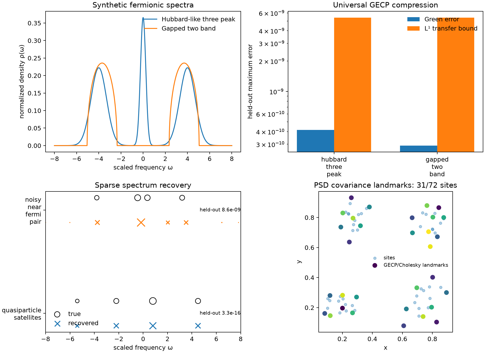

# GECP Kernel Structure

Lean 4 formalization and reproducible Python research package for continuous
Gaussian elimination with complete pivoting (GECP), its positive-definite
pivoted-Cholesky baseline, and the fermionic DLR kernel.

> **Current phase:** S — post-v1 synthetic applications<br>
> **Phase state:** complete<br>
> **Last verification:** `./scripts/verify.sh` passed with 35 tests on 2026-08-15<br>
> **Verification command:** `./scripts/verify.sh`<br>
> **Delivery:** implementation commit `6404311`; final evidence delivered directly to `main` as requested<br>
> **Claim level:** v1 proves the low-rank theorem and an approved GECP obstruction outcome; no fermionic GECP rate is claimed<br>
> **Implementation provenance:** [model/mode, elapsed-time, token, and cost metadata](FINAL_HANDOFF.md#implementation-run-metadata)<br>
> **Workflow:** [`$phase-cadence`](.agents/skills/phase-cadence/SKILL.md)

## Status

| Phase | SPEC milestone | State | Named outputs | Verification evidence | Delivery |
| --- | --- | --- | --- | --- | --- |
| 0 | Bootstrap | complete | two skills, pinned toolchains, CI, package roots | skill validation; focused builds | merged PR #1 |
| A | Exact GECP core | complete | interpolation; run-selected core determinant/nonsingularity | Lean build; axiom audit; exact two-pivot check | merged PR #4 |
| B | PSD baseline | complete | same-domain Schur PSD; diagonal domination; canonical recursive GECP/Cholesky traces; fill bound | Lean axiom audit; tie regression | merged PR #5 |
| C | Fermionic structure/census | complete | exact derivatives/bounds; 128-bit GECP; interval-certified adaptive pivots; endpoint-resolved 21-case census | axiom audit; 27 Python tests; byte-identical census repeat | merged PR #6 |
| D | Separated approximation | complete | `expFamily_separatedApprox`; `fermionicKernel_separatedApprox`; verified dyadic evaluator | axiom audit; 29 tests; full verification | merged PR #7 |
| E | Structural GECP | complete | minimized sign-regular obstruction; `CrossRatioControl`; conditional geometric rate | axiom audit; 30 tests; full verification | merged PR #8 |
| F | Sparse-\(\rho\) application | complete | `greenError_le_kernelError_mul_l1`; OMP/refinement | Lean build; two-atom regression | merged PR #1 |
| R | Release readiness | complete | v1.0.0 handoff; wheel and sdist | full verification; endpoint smoke | merged PR #9; closure PR #10 |
| S | Post-v1 synthetic applications | complete | realistic spectral compression, noisy sparse recovery, PSD landmarks | 35 tests; byte-identical JSON; reviewed plot | implementation `6404311`; direct `main` delivery |

Allowed states are `planned`, `in progress`, `verified`, `complete`, and
`blocked (research)`. A phase becomes `complete` only after its verified change
is merged, or after a verified direct-to-`main` delivery explicitly requested
by the user.

## Quick start

Prerequisites are [uv](https://docs.astral.sh/uv/) and the Lean toolchain
manager `elan`.

```bash
uv sync --all-extras
lake exe cache get
./scripts/verify.sh
```

The Python package is named `kernelgecp` and the Lean library is
`GECPKernelStructure`. See [APPLICATION.md](APPLICATION.md) for API usage,
[FINDINGS.md](FINDINGS.md) for claim status, and [RESEARCH.md](RESEARCH.md) for
theorem history. The v1 delivery summary is in
[FINAL_HANDOFF.md](FINAL_HANDOFF.md), including the bounded
[implementation run metadata](FINAL_HANDOFF.md#implementation-run-metadata).

## Python implementation

`kernelgecp` is the executable research layer of the project. It is not a
second, informal source of mathematical truth: Lean owns the proved theorem
statements, while Python independently realizes the algorithms, exercises the
theorem consequences on exact and high-precision examples, searches for
structure, and produces reproducible application evidence. The package is
typed, deterministic for a fixed configuration, and designed to report
failure or budget exhaustion explicitly instead of converting either into a
successful result.

### Architecture and numerical behavior

| Module | Implementation | Role in the project |
| --- | --- | --- |
| [`kernelgecp/types.py`](kernelgecp/types.py) | Validated `GECPConfig` plus typed GECP, Cholesky, pivot-certificate, high-precision, sparse-fit, and census records | Makes convergence, stopping reason, precision, conditioning, ties, and certification part of the result rather than information hidden in logs |
| [`kernelgecp/kernels.py`](kernelgecp/kernels.py) | Vectorized `FermionicKernel` with sign-dependent overflow-safe formulas, strict domain checks, reflection evaluation, and explicit-precision `mpmath` evaluation | Turns the formal reflection and centered identities into a stable evaluator that remains finite at frequencies as large as `±10⁶` |
| [`kernelgecp/grids.py`](kernelgecp/grids.py) | Composite Chebyshev–Lobatto time grids resolving endpoint layers down to `1/Λ`, and dyadic frequency bands refined near zero and the cutoff | Samples the geometry that a uniform grid would miss as the cutoff grows while keeping the grid construction deterministic |
| [`kernelgecp/gecp.py`](kernelgecp/gecp.py) | Float64 and arbitrary-precision finite-grid GECP, fermionic adaptive GECP, lexicographic near-tie handling, rank-one residual updates, determinant and smallest-singular-value histories, and solve-based cross evaluation | Provides the central experimental algorithm and independently checks interpolation, pivot-product, conditioning, residual, and stopping behavior without forming a numerical inverse |
| [`kernelgecp/cholesky.py`](kernelgecp/cholesky.py) | Canonical diagonal-pivoted Cholesky with symmetry checks, PSD breakdown detection, deterministic ties, factor output, and residual history | Supplies the positive-definite control experiment corresponding to the formal GECP/pivoted-Cholesky equivalence |
| [`kernelgecp/certified.py`](kernelgecp/certified.py) | Priority-queue branch-and-bound using either supplied Lipschitz constants or outward-rounded `mpmath` interval enclosures and optional interval gradients | Separates a sampled large residual from a certified approximate continuous pivot; exhausting `max_cells` returns an uncertified certificate |
| [`kernelgecp/approximation.py`](kernelgecp/approximation.py) | Published rank-count utilities, a high-precision evaluator matching the Lean dyadic truncated-Taylor construction, and a practical piecewise barycentric Chebyshev interpolant | Independently validates the explicit `O(log Λ log(1/ε))` separated construction while keeping the practical interpolant distinct from the theorem |
| [`kernelgecp/surrogates.py`](kernelgecp/surrogates.py) | Exact `Fraction` determinants, exact lexicographic GECP, exhaustive minor-sign enumeration, and the fixed geometric-surrogate census | Lets structural hypotheses fail or survive in exact arithmetic before they are promoted to a theorem contract |
| [`kernelgecp/census.py`](kernelgecp/census.py) | TOML-driven cutoff/tolerance sweeps, one strict trajectory per cutoff, configuration hashing, Git-revision capture, canonical decimal strings, deterministic ordering, and atomic JSONL replacement | Makes the pivot census repeatable and auditable rather than a collection of one-off notebook outputs |
| [`kernelgecp/sparse.py`](kernelgecp/sparse.py) | Orthogonal matching pursuit over candidate frequencies followed by bounded nonlinear least-squares refinement | Demonstrates the problem-specific sparse-spectral alternative to a universal kernel basis and reports non-convergence honestly |
| [`kernelgecp/applications.py`](kernelgecp/applications.py) | Typed configurations and results for continuous-spectrum compression, clean/noisy sparse recovery, Green-function quadrature, and PSD covariance landmarks | Connects the formal and numerical components in deterministic, application-level workloads with held-out errors and explicit evidence boundaries |

There are three deliberately different execution paths:

1. `gecp_matrix` applies complete pivoting to any finite rectangular matrix.
   At 53 bits it uses NumPy; above 53 bits it retains the elimination,
   determinant, and singular-value calculations in `mpmath` and serializes
   canonical decimal values.

2. `gecp(..., config=GECPConfig(pivot="grid"))` evaluates any supplied kernel
   on explicit grids, or uses the canonical endpoint-resolved grids for
   `FermionicKernel`. It is the scalable and exactly repeatable path used by
   the committed census.

3. `gecp(FermionicKernel(...), config=GECPConfig(pivot="adaptive"))` searches
   the continuous rectangle with interval bounds on every successive
   residual. It is more expensive, but each accepted pivot carries lower and
   upper supremum bounds and an implied approximate-pivot factor `eta`.

The direct cross approximation is evaluated as
`K(t, Ω) solve(K(T, Ω), K(T, ω))`; no explicit inverse is formed. Every GECP
run returns the selected coordinates and pivots, residual history, core
determinants and smallest singular values, tie counts, convergence flag, stop
reason, normalized configuration, actual precision, and certificates where
applicable. This makes numerical conditioning and incomplete runs visible to
downstream experiments.

### Why this implementation demonstrates the project objectives

| Project objective | Executable demonstration | Evidence boundary |
| --- | --- | --- |
| Exact GECP algebra | Rank-one updates annihilate selected rows and columns; direct cross residuals agree with iterative residuals; core determinants agree with cumulative pivot products | These are regression checks of the Lean-proved identities, not substitutes for the proofs |
| Positive-definite baseline | GECP and diagonal-pivoted Cholesky select the same canonical pivots on Gaussian Gram matrices, reconstruct the matrix, and agree under diagonal ties | The experiment uses the same documented diagonal-preferring policy as the formal theorem; arbitrary off-diagonal tie rules are not claimed equivalent |
| Fermionic structure | Direct, reflected, float64, and 256-bit kernel evaluations agree; extreme-cutoff endpoint values remain finite; grids resolve the `1/Λ` time layer and dyadic frequency scales | Numerical identity checks support the formal reflection, continuity, derivative, and domain lemmas |
| Explicit low-rank scale | The theorem-matched dyadic evaluator reproduces the formal rank `16p(s+1)` and error bound `2⁻ᵖ`, including band boundaries and cutoff `10⁶`; the separate Chebyshev interpolant demonstrates a practical representation | Low-rank existence is proved, but neither evaluator proves that GECP attains that rank |
| Trustworthy continuous pivoting | Synthetic objectives with known maxima and fermionic residuals receive lower/upper certificates; deliberately exhausted budgets remain `certified=False` | A certificate proves only the stated pivot gap under its analytic or interval enclosure, not a global GECP convergence rate |
| Reproducible research census | The 21 cutoff/tolerance records use 128-bit arithmetic, include the Git revision and configuration hash, and are byte-identical across repeated executions | The observed rank curve is finite-grid evidence and is not promoted to a continuous theorem |
| Structural theorem-or-obstruction research | Exact geometric matrices enumerate every requested minor and pivot path; varying `q` gives exact pivot-order changes, and the minimized `2 × 2` obstruction is regression-tested | Exact minor signs refute an overly strong invariant; they do not establish the refined `CrossRatioControl` hypothesis for the fermionic residual |
| Green-function application | The original two-delta regression is extended by universal compression of continuous Hubbard-like and gapped spectra, exact recovery from a known transition library, and held-out representation of noisy data from a dense blind scan | These demonstrate useful forward compression and effective sparse representation, not uniqueness or general robustness of analytic continuation |

Together these layers cover every project objective with at least one
executable witness, an independent numerical or exact check, and a tested
failure path. They also preserve the central claim boundary: the package
thoroughly demonstrates the algebra, numerical behavior, low-rank existence,
structural obstruction, and application transfer, but it does not manufacture
a fermionic GECP rate from the empirical census.

## Realistic synthetic applications

The post-v1 application suite moves beyond the original two-delta regression
while staying within synthetic, reproducible data. The spectral cases reflect
the intended use of low-rank DLR bases for imaginary-time Green functions in
the [DLR construction](https://arxiv.org/abs/2107.13094). The narrow central
peak plus broad sidebands is a stylized version of the quasiparticle/spectral-
weight structure emphasized in
[DMFT studies of correlated materials](https://arxiv.org/abs/cond-mat/0403123),
and the noisy blind scan reflects the ill-conditioned continuation setting
encountered with imaginary-time data, as discussed in
[parametric analytic continuation](https://arxiv.org/abs/1906.03396). These
fixtures are scientific analogues, not simulated outputs of those papers or
fits to a particular material.



The committed configuration is
[`experiments/synthetic_applications.toml`](experiments/synthetic_applications.toml),
the runner is
[`experiments/synthetic_applications.py`](experiments/synthetic_applications.py),
and the canonical record is
[`experiments/data/synthetic_applications.json`](experiments/data/synthetic_applications.json).

| Application | Delivered result | Utility demonstrated |
| --- | --- | --- |
| Hubbard-like three-peak density | A 128-bit GECP run selects 12 pivots for tolerance `10⁻⁸`; on 2,001 held-out frequency nodes the kernel error is `5.40×10⁻⁹`, while the Green-function error is `4.16×10⁻¹⁰` | One universal basis compresses the frequency discretization by 166.75× and the observed Green error is only 7.70% of the rigorous discrete `L¹` transfer bound |
| Gapped two-band density | The same 12-pivot basis gives Green error `2.91×10⁻¹⁰` below the same `5.40×10⁻⁹` transfer bound | The basis is kernel-universal rather than tuned to one density; qualitatively different metallic-like and insulating-like spectra use the same selected nodes |
| Known transition library | Four unequal quasiparticle/satellite lines are recovered with four atoms and `3.33×10⁻¹⁶` held-out error | When physics supplies a finite candidate transition set, sparse recovery produces a directly interpretable effective Lehmann representation |
| Noisy blind frequency scan | From deterministic `10⁻⁸`-scale time-domain noise and 1,604 candidates, eight effective atoms reach `8.56×10⁻⁹` noiseless held-out error | The package can compress a noisy Green function without claiming that the eight atoms uniquely identify the four generating lines |
| Clustered spatial covariance | GECP and pivoted Cholesky choose the same 31 landmarks from 72 sites; the solve-based cross has maximum error `7.78×10⁻⁷` and relative Frobenius error `1.14×10⁻⁷` | The PSD theorem becomes a practical landmark/sensor-selection control application, with matching pivot paths and positive-semidefinite residual diagnostics |

The JSON record is byte-identical across repeated executions for implementation
commit `6404311`, has configuration hash
`b41f4c17e76ccb108f2999b0e07af1003eb011bf8d96f2c7456e92b9d36f8d35`,
and SHA-256
`f1e989153aa18afa915e3f75630d64019acd7939f65802dd5763b7e6892a8ac2`.
The plot SHA-256 is
`0529263affd2fe10773f71784f06007650bff833374fbbebbb16f2507b2ab169`.

Still-useful extensions include a separation/dynamic-range sweep for blind
atomic recovery, continuous Lorentzian and pseudogap families, Matérn and
periodic covariance controls, and rectangular Cauchy or heat kernels. Those
are future experiments; the delivered suite makes no inverse-problem
uniqueness, material-specific, optimal-landmark, or continuous fermionic GECP
rate claim.

## Claim discipline

Documentation uses four distinct labels: **proved**, **observed**,
**conjectured**, and **not claimed**. In particular, this repository does not
currently claim the target continuous fermionic GECP rate or a solution of
Simons Problem 4.2. Numerical evidence never substitutes for a Lean theorem or
a separately certified analytic argument.

## Delivered evidence

- Endpoint-resolved 128-bit finite-grid census: all 21 cutoff/tolerance cases
  converged, byte-reproducible, SHA-256
  `a0a0a58271000ddd1efcf8514d3ae404eac359a900c7ba4ebc5c92336bf38179`.
- Exact geometric surrogates: every square minor for sizes 2–8 at
  `q ∈ {1/2, 2/3, 3/4}`, SHA-256
  `ccd5d4b948629a6e9642bd5fc18c69c228709752c31c80113036c0e1037f0e82`.
- The exact surrogate pivot order changes with `q`; a universal
  parameter-independent pivot-order invariant is therefore not viable in that
  form.
- The 128-bit release smoke run converged at tolerance `1e-6` for cutoff 1
  (rank 6) and cutoff `1e6` (rank 82), SHA-256
  `d7b5f53d61eb2ea49cd1ebde944b47a06f931b9d82687c8fa4458ac4c09907d5`.
- Realistic synthetic application suite: two continuous spectra, clean and
  noisy sparse recovery, and PSD landmarks, byte-reproducible JSON SHA-256
  `f1e989153aa18afa915e3f75630d64019acd7939f65802dd5763b7e6892a8ac2`.

At tolerance `1e-10`, the sampled rank grows from 8 at cutoff 1 to 124 at
cutoff `1e6`. This is numerical finite-grid evidence, not a continuous GECP
rate theorem. Continuous interval-certified pivoting is a separate supported
mode and is tested on synthetic and fermionic cases; it is not substituted for
the canonical finite-grid census or a Lean convergence proof.
